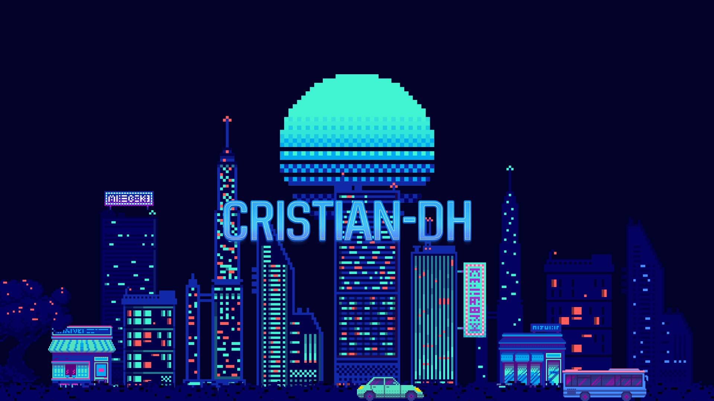

  

<!--
**Cristian-DH/Cristian-DH** is a ✨ _special_ ✨ repository because its `README.md` (this file) appears on your GitHub profile.

Here are some ideas to get you started:

- 🔭 I’m currently working on ...
- 🌱 I’m currently learning ...
- 👯 I’m looking to collaborate on ...
- 🤔 I’m looking for help with ...
- 💬 Ask me about ...
- 📫 How to reach me: ...
- 😄 Pronouns: ...
- ⚡ Fun fact: ...
-->
# Hola, soy Cristian-DH 👋

### Aprendiz de programación 💻

---

## 🙋‍♂️ ¿Quién soy?
Soy un aprendiz apasionado por la tecnología y el desarrollo web.  
Actualmente estoy dando mis primeros pasos en este mundo gracias a **Generation**, donde estoy aprendiendo y construyendo bases sólidas que me permitan crecer como desarrollador.

Me interesa entender cómo funcionan las cosas desde dentro, resolver problemas y crear soluciones que tengan impacto. Cada línea de código que escribo es una oportunidad para mejorar y avanzar.

## 🎓 Formación
**Tecnologias en Telecomunicaciones - USACH**  
**Bootcamp de Generation**

## 📖 Tecnologías que estoy aprendiendo
- HTML
- CSS
- JavaScript
- Git
- GitHub

## 🔥 Motivación
- Cada error me enseña.
- Cada práctica me mejora.
- Aprender de cada error.
- La práctica hace al maestro.
- Cada proyecto me acerca a mi meta.

## 🔥 Mentalidad

Creo firmemente en el aprendizaje constante.  
Los errores no son fallas, son parte del proceso.

- ⚡ Cada error es una lección  
- 🧠 Cada práctica fortalece mis habilidades  
- 🔁 La constancia supera al talento  
- 🚀 Cada proyecto me acerca a mi objetivo  

## 🎯 Objetivo

Convertirme en un desarrollador capaz de crear soluciones reales, eficientes y bien estructuradas, mientras sigo aprendiendo y adaptándome a nuevas tecnologías.

## ✨ Frase personal
**“Construyendo ideas, linea por linea.”**